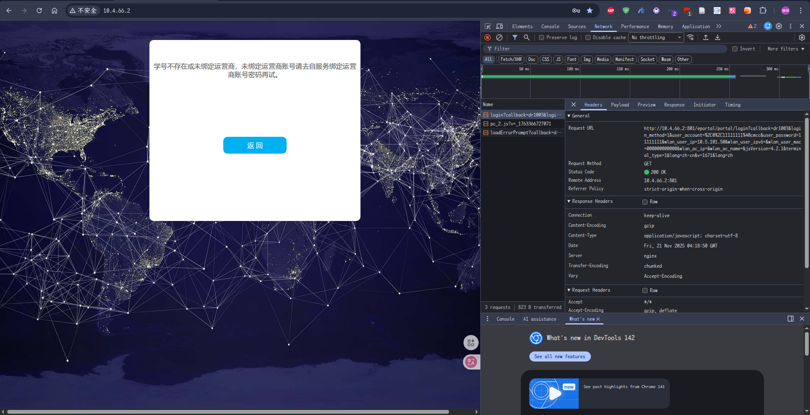
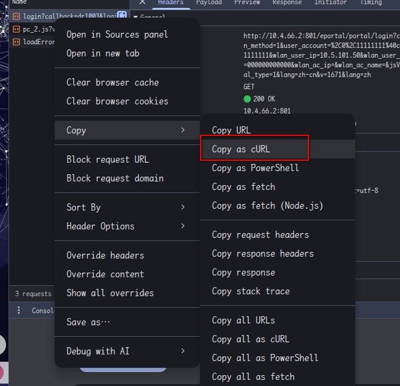
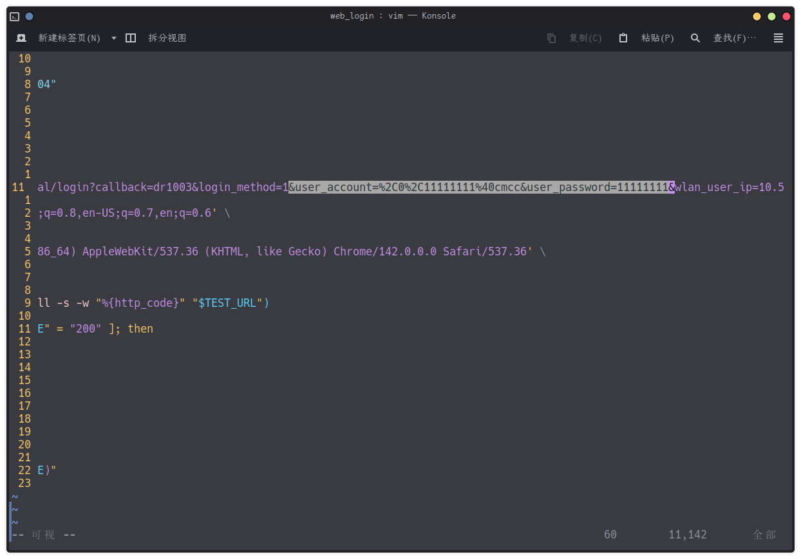
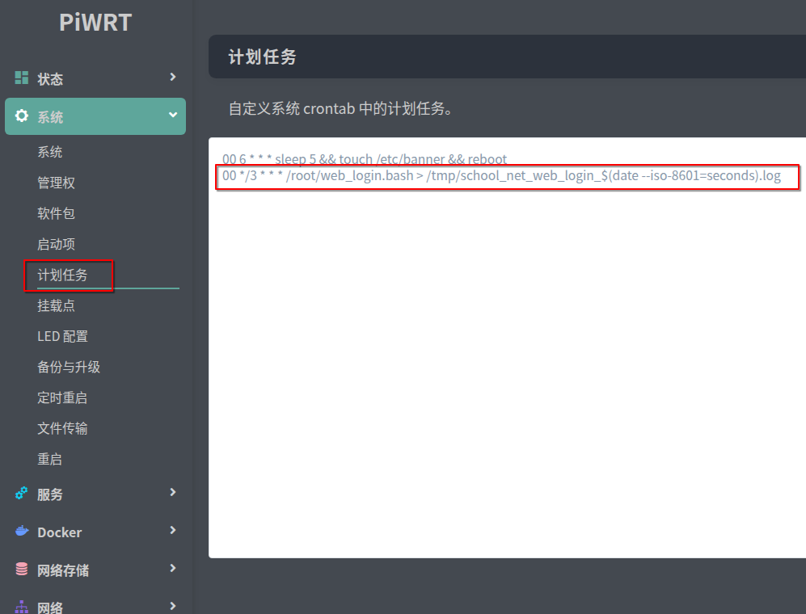

# Auto Web Login to School Internet

## For

For account-password-needed-only systems. Exempli gratia CJLU

## Usage

1. Visit gateway website to login
2. `F12` to open console, and switch to network page. clear all and refresh the page

   
3. Manually login with a wrong account-password (to have a easier test later without logout) A login request should occur in `network` page. Open it and check the `header`

   
4. Copy as `cURL`. And paste into the bash script, edit account and password.

   

   
5. Edit script path in `school_net_web_login.service`; Edit crontab config, run every 3 hour by default
6. Run bash script to login and enable systemd service and crontab task.

## OpenWRT config

1. After editing script with your own `cURL` command, upload the script to the router

    ```bash
    scp /path/to/script root@ip.to.your.router:~/web_login.bash
    ```

2. Login to the dashboard of OpenWRT

3. Add crontab task

   

   ```crontab
   00 */3 * * * /root/web_login.bash > /tmp/web_login_$(date --iso-8601=seconds).log
   ```

   

4. Add task on boot

   

5. Reboot the router or manually run script via SSH

